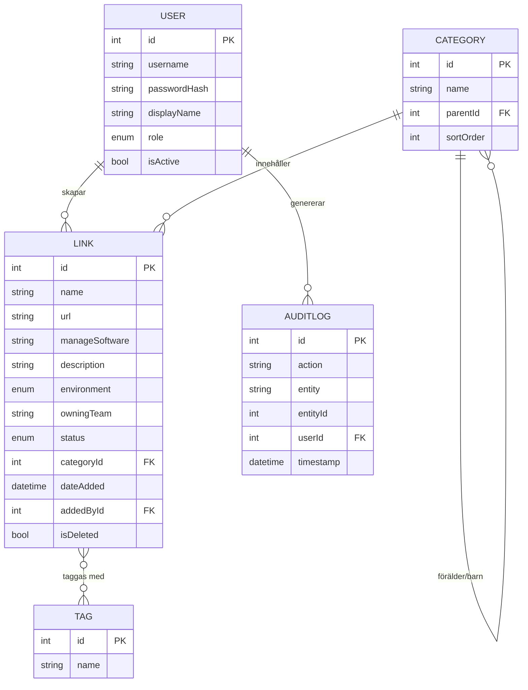

# LinkPortal – Blueprint & Brainstorm

> En intern webbapp för IT-Operations där team samlar alla länkar till verktyg och plattformar – en "Password Manager för länkar".

**Status:** Utkast / Brainstorm
**Version:** Blueprint 0.3
**Datum:** 2026-06-08
**Författare:** IT-Operations
**Beslutat hittills:** Frontend = React + TypeScript (Vite) · Backend = Node.js + Express + Prisma · DB = SQLite · Kategorier hanteras endast av Admin · Chrome-tillägg planerat till V2

---

## 1. Vision & Mål

Idag ligger kunskapen om länkar och managementverktyg spridd hos respektive team. Det skapar:
- Silos – bara ett team vet var saker hanteras.
- Risk vid frånvaro/personalbyte (bus-faktor).
- Tidsspill när man letar efter rätt verktyg.

**Mål med LinkPortal:**
- En central, sökbar katalog över alla IT-verktyg och plattformar.
- Lätt att hitta "var hanterar vi X?" via kategoriträd och sökning.
- Tydlig ägarskap och spårbarhet (vem la till, när).
- Enkel behörighetsstyrning (Admin/Editor/Viewer).

---

## 2. Scope

### Version 1 (denna blueprint)
- Inloggning med intern User/Password-tabell.
- CRUD för länkar (skapa/läs/uppdatera; radera endast Admin).
- Kategoriträd (hierarkiskt, klickbart).
- Roller: **Admin**, **Editor**, **Viewer**.
- Sökning och filtrering.
- Audit-fält: `DateAdded`, `DateAddedBy`.

### Version 2 (planerad – ej i denna iteration)
- **Chrome-tillägg (extension)** som läser från servern: en ikon i Chrome-verktygsfältet som vid klick visar kategoriträdet med länkar i en popup. Se avsnitt 11.

### Uttalat utanför scope för V1 (idéer för senare)
- SSO / Azure Entra ID-inloggning (ersätter lokala lösenord).
- Favoriter / "mina länkar".
- Taggar utöver kategori.
- Klickstatistik / "mest använda".
- Health-check (pingar länken och visar om den lever).
- Import/Export (CSV, JSON).
- Lösenordsskåp/credentials (medvetet INTE – vi länkar bara, lagrar inga hemligheter).
- Versionshistorik per post.
- Notifieringar (t.ex. trasig länk).

---

## 3. Datamodell

### 3.1 Link (huvudentitet)
| Fält | Typ | Beskrivning |
|------|-----|-------------|
| `Id` | GUID/int | Primärnyckel |
| `Name` | string | Namn på verktyg/länk (obligatoriskt) |
| `CategoryId` | FK | Koppling till kategoriträdet |
| `Url` | string | Själva länken (obligatoriskt, valideras) |
| `ManageSoftware` | string | Programvara som används för att managera (t.ex. "vCenter", "FortiGate") |
| `Description` | text | Fritext |
| `DateAdded` | datetime | Sätts automatiskt |
| `DateAddedBy` | FK User | Sätts automatiskt från inloggad användare |
| `DateModified` | datetime | (rekommenderat) Senast ändrad |
| `ModifiedBy` | FK User | (rekommenderat) Vem ändrade senast |

### 3.2 Category (självrefererande träd)
| Fält | Typ | Beskrivning |
|------|-----|-------------|
| `Id` | int | Primärnyckel |
| `Name` | string | T.ex. "Firewall" |
| `ParentId` | FK (nullable) | Pekar på förälder; `null` = rotnivå |
| `SortOrder` | int | (valfritt) Manuell ordning |

**Exempel på trädstruktur:**
```
IT-Network
 ├─ Firewall
 └─ Wifi
IT-Infra
 ├─ Server
 │   └─ VMware
 └─ SQL
```

> **Designval:** Adjacency list (`ParentId`) är enklast att förstå och räcker gott för denna skala. Alternativet "materialized path" behövs först vid mycket djupa/stora träd.

### 3.3 User
| Fält | Typ | Beskrivning |
|------|-----|-------------|
| `Id` | int | Primärnyckel |
| `Username` | string | Unikt |
| `PasswordHash` | string | **Aldrig** klartext – hashas med bcrypt/argon2 |
| `Role` | enum | `Admin` / `Editor` / `Viewer` |
| `DisplayName` | string | Visningsnamn |
| `IsActive` | bool | Möjlighet att inaktivera utan att radera |
| `CreatedAt` | datetime | |

### 3.4 Behörighetsmatris
| Åtgärd | Viewer | Editor | Admin |
|--------|:------:|:------:|:-----:|
| Se länkar & kategorier | ✅ | ✅ | ✅ |
| Sök/filtrera | ✅ | ✅ | ✅ |
| Skapa länk | ❌ | ✅ | ✅ |
| Redigera länk | ❌ | ✅ | ✅ |
| **Radera länk** | ❌ | ❌ | ✅ |
| Hantera kategorier (skapa/ändra/radera) | ❌ | ❌ | ✅ |
| Hantera användare | ❌ | ❌ | ✅ |

> **Beslut:** Endast **Admin** hanterar kategoriträdet. Editor kan välja bland befintliga kategorier men inte skapa nya.

---

## 4. Funktionalitet / Features

### 4.1 Inloggning
- Login-sida (Username + Password).
- Server validerar mot User-tabell, lösenord jämförs mot hash.
- Vid lyckad inloggning: JWT-token (eller HTTP-only session-cookie).
- Logout.
- (V1) Admin skapar användare manuellt; ingen självregistrering.

### 4.2 Huvudvy (Dashboard)
- **Vänster panel:** Kategoriträd (expanderbart/kollapsbart). Klick filtrerar.
- **Huvudyta:** Lista/kort med länkar för vald kategori.
- **Topp:** Sökfält (söker i Name, Description, ManageSoftware, Url).
- Visa antal länkar per kategori.

### 4.3 Länk-kort / lista
Per länk visas: Name, Kategori-sökväg (breadcrumb), Url (klickbar, öppnas i ny flik), ManageSoftware, Description (förkortad), DateAdded + DateAddedBy.
- "Copy link"-knapp.
- Edit-knapp (Editor/Admin).
- Delete-knapp (endast Admin, med bekräftelse).

### 4.4 Skapa/Redigera länk (formulär)
Fält: Name, Kategori (träd-väljare/dropdown), Url, ManageSoftware, Description.
- `DateAdded`/`DateAddedBy` sätts automatiskt – inte synliga som inmatning.
- URL-validering (måste vara giltig http/https).
- Obligatoriska: Name, Url, Kategori.

### 4.5 Kategorihantering (endast Admin)
- Skapa/byt namn/flytta kategori.
- Förhindra radering av kategori som har länkar (eller flytta länkar först).
- Editor/Viewer kan se och välja kategorier men inte ändra trädet.

### 4.6 Användarhantering (Admin)
- Lista användare, skapa ny, ändra roll, inaktivera, återställ lösenord.

### 4.7 Sök & filter
- Fritextsök.
- Filtrera på kategori (via trädet).
- (Senare) sortering: namn, senast tillagd.

---

## 5. Teknisk Arkitektur

```
┌─────────────────────────┐      HTTPS / REST      ┌──────────────────────────┐
│      Frontend (SPA)      │  ───────────────────►  │        Backend API        │
│  React + TypeScript      │  ◄───────────────────  │   (REST + Auth + Logik)   │
│  Vite, React Router      │      JSON / JWT        │                           │
└─────────────────────────┘                        └────────────┬─────────────┘
                                                                  │
                                                                  ▼
                                                        ┌──────────────────┐
                                                        │     Databas       │
                                                        │  Users/Links/Cat  │
                                                        └──────────────────┘
```

### 5.1 Frontend (begärt: React)
- **React + TypeScript** (typsäkerhet, färre buggar).
- **Vite** som byggverktyg (snabbt).
- **React Router** för vyer (login, dashboard, admin).
- **State/data:** TanStack Query (React Query) för API-anrop + cache.
- **UI:** Förslag – Tailwind CSS + komponenter (t.ex. shadcn/ui) ELLER Material UI (MUI). Beslut tas i nästa steg.
- **Formulär:** React Hook Form + Zod-validering.

### 5.2 Backend ✅ (beslutat: Node.js)
- **Node.js + TypeScript** med **Express** (eller Fastify). Samma språk som frontend → en stack, ett team.
- **ORM:** Prisma (typsäkert, enkla migrationer, bra SQLite-stöd).
- **Auth:** JWT (`jsonwebtoken`) + lösenordshashning (`bcrypt`).
- **Validering:** Zod (delas med frontend).

### 5.3 Databas ✅ (beslutat: SQLite)
- **SQLite** – en enda fil, noll setup, perfekt för intern app i denna skala.
- Prisma hanterar schema + migrationer. Backup = kopiera `.db`-filen.
- Om behovet växer senare kan Prisma byta till PostgreSQL med minimal ändring.

### 5.4 Autentisering & Säkerhet
- Lösenord hashas med **bcrypt** eller **argon2** (aldrig klartext, aldrig MD5/SHA1).
- **JWT** i HTTP-only, Secure cookie (skydd mot XSS-stöld).
- HTTPS överallt.
- Rollbaserad åtkomstkontroll (RBAC) – kontrolleras **på backend**, inte bara döljs i UI.
- Skydd mot: SQL-injection (parametriserade queries/ORM), XSS (escaping), CSRF (token/SameSite-cookie).
- Rate limiting på login (skydd mot brute force).
- Audit-logg på radering (vem raderade vad, när).

---

## 6. Föreslagen Projektstruktur

```
LinkPortal/
├─ BLUEPRINT.md            ← detta dokument
├─ frontend/               ← React + TypeScript (Vite)
│  ├─ src/
│  │  ├─ pages/            (Login, Dashboard, Admin)
│  │  ├─ components/       (CategoryTree, LinkCard, LinkForm, ...)
│  │  ├─ api/              (API-klient, React Query hooks)
│  │  ├─ auth/             (auth-context, skyddade rutter)
│  │  └─ types/
│  └─ ...
├─ backend/                ← API (Node.js + Express + TypeScript + Prisma)
│  ├─ src/
│  │  ├─ routes/           (auth, links, categories, users, extension)
│  │  ├─ models/
│  │  ├─ middleware/       (auth, RBAC, validering)
│  │  └─ db/               (Prisma schema, migrationer, seed)
│  └─ ...
├─ extension/              ← Chrome-tillägg (V2 – byggs senare)
│  ├─ manifest.json
│  ├─ popup.html
│  ├─ popup.js             (hämtar trädet från /api/extension/tree)
│  └─ icons/
└─ README.md
```

---

## 7. API-skiss (REST)

| Metod | Endpoint | Behörighet | Beskrivning |
|-------|----------|-----------|-------------|
| POST | `/api/auth/login` | Alla | Logga in, returnerar token |
| POST | `/api/auth/logout` | Inloggad | Logga ut |
| GET | `/api/links` | Viewer+ | Lista/sök länkar (filter: `?categoryId=&q=`) |
| GET | `/api/links/:id` | Viewer+ | Hämta en länk |
| POST | `/api/links` | Editor+ | Skapa länk |
| PUT | `/api/links/:id` | Editor+ | Uppdatera länk |
| DELETE | `/api/links/:id` | **Admin** | Radera länk |
| GET | `/api/extension/tree` | Viewer+ | Hela kategoriträdet med länkar (för Chrome-tillägget, V2) |
| GET | `/api/categories` | Viewer+ | Hela kategoriträdet |
| POST | `/api/categories` | **Admin** | Skapa kategori |
| PUT | `/api/categories/:id` | **Admin** | Byt namn/flytta |
| DELETE | `/api/categories/:id` | **Admin** | Radera kategori (om tom) |
| GET | `/api/users` | Admin | Lista användare |
| POST | `/api/users` | Admin | Skapa användare |
| PUT | `/api/users/:id` | Admin | Ändra roll/återställ lösenord |

---

## 8. UX-flöden

**Hitta en länk:**
1. Logga in → 2. Klicka i kategoriträdet ELLER sök → 3. Se länklista → 4. Klicka länk (ny flik) eller kopiera URL.

**Lägga till en länk (Editor):**
1. Klicka "Ny länk" → 2. Fyll i formulär, välj kategori → 3. Spara → 4. Visas direkt i listan med DateAdded/By.

**Radera (Admin):**
1. Öppna länk → 2. Delete → 3. Bekräfta i dialog → 4. Borttagen + loggad.

---

## 9. Öppna frågor (besluta innan bygge)

1. ~~**Backend-stack**~~ ✅ **Node.js + TypeScript (Express + Prisma)**
2. ~~**Databas**~~ ✅ **SQLite**
3. ~~**Kategorihantering**~~ ✅ **Endast Admin**
4. **Hosting:** Var ska appen köras? On-prem (Node/PM2 eller IIS-reverse proxy), Docker-container, Azure App Service?
5. **UI-bibliotek:** Tailwind+shadcn eller MUI?
6. **Initiala användare:** Första Admin-kontot via seed-script (förslag). Bekräfta användarnamn/lösenordsrutin.
7. **Framtid SSO:** Ska vi designa så Entra ID kan ersätta lokala lösenord senare? (påverkar inget tungt nu)
8. **Branding:** Ragn-Sells färger/logga i UI?
9. **Chrome-tillägg (V2):** Autentisering i tillägget – återanvänd inloggning/token eller läs-only-nyckel? Se avsnitt 11.

---

## 10. Föreslagna nästa steg

1. ✅ Godkänn/justera denna blueprint.
2. Besluta kvarvarande öppna frågor i avsnitt 9 (hosting, UI-bibliotek, branding).
3. Sätt upp projektskelett (frontend React/Vite + backend Node/Express/Prisma + SQLite).
4. Implementera datamodell (Prisma-schema) + migrationer + seed (Admin-konto + exempelkategorier).
5. Bygg auth (login + JWT + RBAC).
6. Bygg kategoriträd + länk-CRUD.
7. Sök/filter + polish.
8. Testning + driftsättning.
9. *(V2)* Bygg Chrome-tillägget mot `/api/extension/tree`.

---

## 11. Chrome-tillägg (Version 2)

### 11.1 Koncept
En ikon i Chrome-verktygsfältet. Klick öppnar en popup som visar **kategoriträdet med länkar** – samma data som i webbappen, men alltid ett klick bort oavsett vilken sida man är på. Tänk "bokmärkesmeny på steroider", driven av LinkPortal-servern.

```
┌──────────────────────────────┐
│  🔗 LinkPortal        [⚙] [↻] │  ← header: sök, inställningar, refresh
├──────────────────────────────┤
│  🔍 [ Sök länk...          ]  │
├──────────────────────────────┤
│  ▾ IT-Network                 │
│     ▾ Firewall                │
│        • FortiManager      ↗  │
│        • Palo Alto Panorama↗  │
│     ▸ Wifi                    │
│  ▾ IT-Infra                   │
│     ▾ Server                  │
│        ▾ VMware               │
│           • vCenter        ↗  │
│     ▸ SQL                     │
└──────────────────────────────┘
```

### 11.2 Teknik
- **Manifest V3** (krav för nya Chrome-tillägg).
- `action.default_popup` → `popup.html` + `popup.js`.
- Popup hämtar `GET /api/extension/tree` och renderar trädet (vanlig JS eller liten React-bundle).
- **Cache:** spara senaste trädet i `chrome.storage.local` så popupen öppnas direkt offline, uppdateras i bakgrunden.
- Klick på länk → `chrome.tabs.create({ url })` (öppnar i ny flik).

### 11.3 Autentisering (designfråga – avsnitt 9.9)
Tre alternativ, från enklast till säkrast:
- **A) Personlig API-token:** Användaren loggar in i webbappen → genererar en "Extension token" → klistrar in i tilläggets inställningar. Enkelt, token kan återkallas.
- **B) Delad inloggning via cookie:** Om tillägget och appen delar domän kan en HTTP-only-cookie återanvändas. Smidigt internt men kräver samma origin/host.
- **C) OAuth/Entra ID:** Overkill för V1/V2, men rätt väg om SSO införs senare.

> **Förslag:** Börja med **A (personlig token)**. Lätt att bygga, lätt att spärra, ingen extra inloggningsdialog i popupen.

### 11.4 Distribution
- Internt: ladda som "unpacked" eller paketera `.crx` och distribuera via **Group Policy / Chrome Enterprise** (rekommenderat – auto-installeras på alla IT-datorer).
- Undvik publik Chrome Web Store (intern app, ingen anledning att exponera).

### 11.5 Framtida tilläggsfinesser
- Högerklick-meny: "Lägg till denna sida i LinkPortal" (skickar aktuell flik-URL till skapa-formuläret).
- Omnibox: skriv `lp` + sökord i adressfältet → hoppa direkt till en länk.
- Badge med antal länkar eller "nyligen tillagda".

---

## 12. Brainstorm – idéer, förslag & frågor

> Friare avsnitt där jag (Copilot) tar ut svängarna. Inget här är beslutat – det är råmaterial att plocka godbitar ur. Markera det du gillar så lyfter vi in det i scope.

### 12.1 "Quick wins" som ger mycket värde för lite jobb
- **Copy-knapp på varje länk** – kopierar URL till urklipp. Litet, men används konstant.
- **Öppna i ny flik som default** – interna verktyg vill man sällan navigera bort från nuvarande sida för.
- **"Senast tillagda"-vy** på dashboarden – snabb känsla för vad som hänt.
- **Favicon-hämtning** – visa verktygets ikon automatiskt bredvid namnet (hämta `https://domän/favicon.ico`). Gör listan visuellt skannbar direkt.
- **Tom-läge / onboarding** – när databasen är tom, visa "Skapa din första länk" istället för en tom yta.
- **Breadcrumbs** – visa full kategorisökväg (IT-Infra › Server › VMware) på varje länk.

### 12.2 Sök & navigering (gör eller dö-funktion)
- **Global snabbsök (Ctrl/Cmd+K)** – en "command palette" som öppnar overlay, skriv → fuzzy-matcha länkar → Enter öppnar. Detta blir troligen den mest använda funktionen i hela appen. Starkt förslag.
- **Fuzzy matching** – "vcntr" ska hitta "vCenter".
- **Sök även i ManageSoftware** – "jag vet att det hanteras i Panorama, vad var länken?".
- **Nyligen besökta** (per användare, lokalt) – appen kommer ihåg vad just du klickar mest på.
- **Tangentbordsnavigering** i trädet (pilar + Enter).

### 12.3 Datamodell – förslag på utbyggnad (V1.x / V2)
Idéer utöver grundfälten. Vissa kan smyga in redan i V1 om de är billiga:

| Fält/feature | Värde | När |
|--------------|-------|-----|
| `Tags` (många-till-många) | Tvärsökning oberoende av kategori (t.ex. "prod", "kritisk", "extern leverantör") | V1.x |
| `Environment` (enum: Prod/Test/Dev) | Filtrera "visa bara produktionssystem" | V1.x |
| `Owner` / `OwningTeam` | Vem ansvarar – inte bara vem som råkade lägga in länken | V1.x |
| `IsFavorite` (per användare) | Personliga genvägar | V2 |
| `LastVerifiedAt` | "Senast kontrollerad att länken funkar" – manuellt eller via health-check | V2 |
| `Status` (Active/Deprecated) | Markera utfasade verktyg utan att radera | V1.x |
| `Notes` / interna anteckningar | Längre driftnotiser separat från Description | V2 |
| `RelatedLinks` | Koppla ihop relaterade verktyg (t.ex. vCenter ↔ ESXi-host) | V2 |

> **Designtanke:** Taggar + Environment + Owner är förvånansvärt billiga att lägga till nu (det är bara fält/relationer) men dyra att efterkonstruera när det finns 500 länkar. Värt att överväga redan i V1.

### 12.4 Säkerhet & drift (lågmält men viktigt)
- **Audit-logg som egen tabell** (`AuditLog`: vem, vad, när, gammalt/nytt värde) – inte bara på radering utan på alla ändringar. Guld värt vid "vem ändrade länken?".
- **Soft delete** istället för hård radering – `IsDeleted`-flagga. Admin kan ångra. Riktig radering blir en separat "töm papperskorgen".
- **Automatisk backup** av SQLite-filen (schemalagd kopiering, behåll N senaste).
- **Inaktiv-timeout** på sessioner.
- **Lösenordspolicy** – minlängd, eventuellt tvinga byte vid första inloggning för seed-konton.
- **Read-only "publik" länk?** Nej – håll allt bakom inloggning enligt scope.

### 12.5 Health-check / länk-validering (riktigt nyttigt på sikt)
- Bakgrundsjobb som periodiskt pingar varje URL och flaggar 404/timeout.
- Visuell indikator: 🟢 lever / 🔴 svarar inte / ⚪ ej testad.
- Dashboard-widget: "3 länkar svarar inte". Hjälper hålla katalogen ren.
- Obs: interna länkar bakom brandvägg kan bara testas från en server som står innanför – bra att tänka på.

### 12.6 Användbarhet & administration
- **Bulk-import** av befintliga länkar (CSV/JSON) – varje team sitter redan på en lista i en Excel/OneNote. Gör onboardingen smärtfri. Stark kandidat för tidig V1.x.
- **Bulk-flytta länkar** mellan kategorier (Admin).
- **Drag-and-drop** i kategoriträdet för att omorganisera (Admin).
- **Dubblettvarning** – varna om samma URL redan finns när man skapar.
- **Aktivitetsflöde** – "Anna la till FortiManager för 2h sedan".

### 12.7 UX / utseende
- **Dark mode** – IT-folk uppskattar det, billigt med Tailwind/MUI.
- **Densitetsval** – kompakt lista vs. luftiga kort.
- **Två vyer:** trädvy (utforska) och platt sökvy (hitta snabbt).
- **Responsivt** – funkar i mobil webbläsare för on-call-scenarier.
- **Ragn-Sells-branding** – logga, primärfärg. Liten insats, känns "vår".

### 12.8 Större framtidsvisioner (V3+, drömläge)
- **SSO via Entra ID** – ingen lösenordshantering alls, automatisk roll-mappning från AD-grupper. Troligt slutmål.
- **Secrets-integration** – länka (inte lagra) till Azure Key Vault / lösenordshanterare per verktyg.
- **CMDB-koppling** – synka med befintlig tillgångsdatabas om sådan finns.
- **Slack/Teams-bot** – "/linkportal vcenter" returnerar länken i chatten.
- **Runbook-koppling** – varje länk kan peka på en driftinstruktion/wiki.
- **API-nycklar för automation** – andra interna system kan läsa länkkatalogen.

### 12.9 Risker & saker att undvika
- **Scope creep** – det är frestande att bygga allt ovan. V1 ska vara litet och leverera: inloggning, träd, CRUD, sök. Punkt.
- **Bli en "credential store"** – håll fast vid att vi länkar, inte lagrar hemligheter. Annars ärver vi en massa säkerhetskrav.
- **Föråldrad data** – en länkkatalog dör om ingen underhåller den. Därför: health-check, "senast verifierad", ägarskap och låg friktion att lägga till.
- **Övergeneralisering av kategoriträd** – för djupa träd blir jobbiga. Sikta på max ~3–4 nivåer i praktiken.

### 12.10 Frågor till dig (besvara när du är tillbaka)
1. **Taggar + Environment + Owner i V1?** Billigt nu, dyrt senare. Min rekommendation: ta med åtminstone Tags och Environment direkt.
2. **Soft delete?** Vill du att Admins "delete" är ångerbart (papperskorg) eller permanent direkt?
3. **Bulk-import** – sitter teamen redan på Excel-listor vi vill suga in? I så fall prioriterar vi import tidigt.
4. **Command palette (Ctrl+K)** – låter det attraktivt som primär sökmetod?
5. **Favicon-hämtning** – ok att appen hämtar ikoner från länkmålen, eller känsligt p.g.a. interna adresser?
6. **Health-check** – finns en server innanför brandväggen som kan köra periodiska pingar mot interna verktyg?
7. **Dark mode + Ragn-Sells-branding** – vill du ha det från start?
8. **Hur stor blir katalogen?** Grov gissning på antal länkar och antal användare hjälper mig dimensionera (SQLite klarar gott tiotusentals, så troligen inga problem).
9. **Kategoristruktur** – har ni redan en mental modell för toppnivåerna (IT-Network, IT-Infra, ...) jag kan seeda som exempel?
10. **Chrome-tillägget** – ok att börja med personlig API-token (avsnitt 11.3 A)?

### 12.11 Min rekommenderade V1-scope (skarp avgränsning)
För att faktiskt bli klara föreslår jag att **V1 = exakt detta**:
- Inloggning (lokala användare, bcrypt, JWT, 3 roller).
- Kategoriträd (Admin hanterar, alla ser/väljer).
- Länk-CRUD med fälten: Name, Category, Url, ManageSoftware, Description, + auto DateAdded/By, DateModified/By.
- **Plus billiga extras jag starkt rekommenderar redan nu:** Tags, Environment, Owner-fält, soft delete, audit-logg, copy-knapp, command palette-sök, favicon.
- Seed: 1 Admin + exempelkategorier.

Allt annat (Chrome-tillägg, health-check, bulk-import, SSO, dark mode-polish) = V2+.

---

## 13. Backlog V3 (kandidater för nästa iteration)

> Idéer som mognat fram efter att V1/V2 byggts (inloggning, kategoriträd, länk-CRUD, favoriter, per-användartema, i18n och Chrome/Edge-tillägget är redan på plats). Listan är prioriterad i tre block. Inget är beslutat – plocka det som ger mest nytta härnäst.

### 13.1 Topprioritet (störst nytta för IT-Ops)
- **Health-check / länkstatus** – Bakgrundsjobb som periodiskt pingar varje URL och visar 🟢 lever / 🔴 svarar inte / ⚪ ej testad. Dashboard-widget "X länkar svarar inte". Obs: interna länkar bakom brandvägg måste testas från en server innanför nätet. **Byggd – se avsnitt 14 för design.**
- **Taggar utöver kategori** – Many-to-many-lager ovanpå trädet för korsfiltrering (t.ex. "produktion" + "firewall"). Schemat i Appendix A har redan `Tag`-modellen förberedd. **Byggd (korsfiltrering med tagg-/miljödropdowns).**
- **SSO / Entra ID** – Ersätter lokala lösenord, automatisk roll-mappning från AD-grupper. Störst men högst värde för en intern Ragn-Sells-app (öppen fråga #7).

### 13.2 Organisation, sök & data
- **Klickstatistik / "mest använda"** – Räkna klick per länk och visa en datadriven topplista (utöver personliga favoriter).
- **"Senast tillagda / senast ändrade"-vy** – Kronologisk vy (bygger på `LinkListEdited.tsx` + ISO-datum som redan finns).
- **Sparade filter / smarta vyer** – "Mina team-länkar", "Allt i Produktion" (bygger på taggar + ägande team).
- **Senast besökta** – Personlig recent-lista, frikopplad från favoriter.
- **Dubblett-detektion** – Varna vid skapande om samma URL redan finns.
- **Import/Export (CSV/JSON)** – Suga in befintliga Excel/OneNote-listor och ta backup.
- **Versionshistorik per länk** – Diff-historik per post ovanpå audit-loggen ("vem ändrade URL:en?").

### 13.3 Drift, integration & polish
- **Trasig länk-notifieringar** – Maila/Teams-pinga ägande team när deras länk dör (bygger på health-check).
- **Bulk-åtgärder** – Markera flera länkar → flytta kategori / massradera (Admin).
- **Drag-and-drop i kategoriträdet** (Admin) – Omorganisera visuellt istället för via formulär.
- **Context-meny "Spara till LinkPortal"** – Högerklick på valfri länk på en sida → spara direkt via tillägget.
- **Teams/Slack-kommando** – `/linkportal vcenter` returnerar länken i chatten.
- **Kopiera som Markdown/HTML** – Kopiera `[Namn](url)` för inklistring i wiki/Teams.
- **Dark mode** – Mörkt tema ovanpå det befintliga per-användartemat.
- **Auto-favicon vid skapande** – Hämta verktygets ikon automatiskt.
- **QR-kod per länk** – Dela en intern länk snabbt till mobil/skärm.
- **Raderade flyttas till en egen kategori och visas inte på andra urval. En vy som visar de som är raderade, knapp för radera hårt, knapp för att återställa dit den låg tidigare.


---

*Detta är ett levande dokument. Kommentera/ändra direkt i filen så uppdaterar vi blueprinten innan vi börjar koda.*

---

## 14. Health-check / länkstatus – design (beslutad)

> Bestämd design för health-check-funktionen i Backlog V3 (avsnitt 13.1). Detta avsnitt är beslutsunderlaget vi bygger efter.

### 14.1 Förutsättningar (beslut)
- **Placering:** Backend körs på en webbserver i **Management-WLAN** som når alla interna hostar → ingen brandväggsbegränsning, alla länkar är testbara.
- **Syfte:** Inte ett fullskaligt övervakningsverktyg, utan en enkel "lever länken?"-indikator som hjälper till att hålla katalogen ren.

### 14.2 Hur ett test går till (per protokoll)
Porten härleds från URL-schemat (explicit port i URL:en vinner alltid):

| Schema | Test | Default-port | Tolkning |
|--------|------|-------------|----------|
| `https://` | HTTP HEAD/GET, kort timeout, följ **ej** redirects | 443 | Alla svar (även 401/403/500) = 🟢 UP. Endast timeout/DNS-fel/connection refused = 🔴 DOWN. |
| `http://` | HTTP HEAD/GET | 80 | Som ovan. |
| `rdp://` | **TCP-portkoll** (`net.connect`) | 3389 | Porten öppen = 🟢, annars 🔴. |
| `ssh://` | **TCP-portkoll** | 22 | Som ovan. |
| annat/okänt | hoppa över | — | ⚪ UNKNOWN (ej testbar). |

> TCP-kollen i Node motsvarar `Test-NetConnection -ComputerName <host> -Port <port>`: anslut med kort timeout (t.ex. 3 s), lyckas = UP. RDP/SSH är de man oftast vill testa, och de testas just via portkoll.

### 14.3 Två oberoende jobb-loopar
- **Bas-loop:** kör **alla** länkar med ett globalt intervall (Settings, **default 4 h**).
- **Extra Monitor-loop:** kör **bara** länkar som har `extraMonitor = true`, var och en på sitt **egna intervall (minuter)**. Tanken: starta tät bevakning på en specifik host man arbetar med – t.ex. var 1:a minut – utan att dra igång hela katalogen och störa nätet. Bocka ur när man är klar.

Dessutom manuella triggers:
- **"Testa alla nu"** – global knapp (Editor+), kör bas-svepet direkt.
- **"Test Connection"** – knapp på varje kort/rad (Editor+), testar bara den länken omedelbart.

### 14.4 Datamodell (utbyggnad av `Link` + egen historiktabell)
```prisma
model Link {
  // ...befintliga fält...
  healthStatus        String    @default("UNKNOWN")  // UP / DOWN / UNKNOWN
  lastCheckedAt       DateTime?
  lastStatusCode      Int?       // HTTP-kod (null för TCP-test)
  lastLatencyMs       Int?       // svarstid i ms
  extraMonitor        Boolean   @default(false)
  extraMonitorMinutes Int?       // eget intervall i minuter när extraMonitor = true
  checks              HealthCheck[]
}

model HealthCheck {
  id         Int      @id @default(autoincrement())
  linkId     Int
  link       Link     @relation(fields: [linkId], references: [id])
  status     String   // UP / DOWN
  statusCode Int?
  latencyMs  Int?
  checkedAt  DateTime @default(now())

  @@index([linkId, checkedAt])
}
```

### 14.5 Historik & retention
- Varje körning skrivs till `HealthCheck` (egen tabell – kan bli många rader).
- **Settings: retention i dagar** – ett städjobb tar bort rader äldre än X dagar (default t.ex. 30).
- Indexet `[linkId, checkedAt]` gör både historik-uppslag och städning effektiva.

### 14.6 Settings (nya fält)
- **Health-check-intervall** (timmar, default 4) – bas-loopen.
- **Test-timeout** (sekunder, default 3–5).
- **Historik-retention** (dagar, default 30).
- **Av/på** för hela health-check-jobbet.
- (Per länk, inte global: `extraMonitor` + `extraMonitorMinutes`.)

### 14.7 Behörigheter
| Åtgärd | Viewer | Editor | Admin |
|--------|:------:|:------:|:-----:|
| Se status (🟢/🔴/⚪) | ✅ | ✅ | ✅ |
| "Test Connection" / "Testa alla nu" | ❌ | ✅ | ✅ |
| Sätta `extraMonitor` + minuter på en länk | ❌ | ✅ | ✅ |
| Ändra intervall-/retention-settings | ❌ | ❌ | ✅ |

### 14.8 Säkerhet (SSRF-skydd, inbyggt från start)
- Kort timeout, **följ inte redirects**, läs **inte** svarsbody, skicka **aldrig** cookies/credentials.
- HTTP-test gör bara HEAD/GET och bryr sig bara om att *något* svar kom (statuskod), inte innehållet.
- Metadata-IP (`169.254.169.254`) och loopback hålls i en dokumenterad spärrlista; i övrigt tillåts interna IP medvetet (backend *ska* nå Management-nätet).

### 14.9 UI
- Liten statusprick (🟢/🔴/⚪) på varje kort och i listvyn, med tooltip: senaste kontroll + svarstid/statuskod.
- Dashboard-widget: **"X länkar svarar inte"** som länkar till ett filtrerat urval av 🔴.
- I länkformuläret (Editor+): kryssruta **Extra Monitor** + fält för minuter.
- I Settings (Admin): bas-intervall, timeout, retention, av/på.

---

## Appendix A – Föreslaget Prisma-schema (utkast)

> Konkret förslag på hur datamodellen kan se ut i Prisma med SQLite. Inkluderar de "billiga extras" (Tags, Environment, Owner, soft delete, audit-logg) från brainstormen – kommentera bort det du inte vill ha i V1.

```prisma
// schema.prisma (utkast – inte slutgiltigt)

datasource db {
  provider = "sqlite"
  url      = "file:./linkportal.db"
}

generator client {
  provider = "prisma-client-js"
}

enum Role {
  ADMIN
  EDITOR
  VIEWER
}

enum Environment {
  PROD
  TEST
  DEV
  NA
}

enum LinkStatus {
  ACTIVE
  DEPRECATED
}

model User {
  id           Int       @id @default(autoincrement())
  username     String    @unique
  passwordHash String
  displayName  String
  role         Role      @default(VIEWER)
  isActive     Boolean   @default(true)
  createdAt    DateTime  @default(now())

  // relationer
  createdLinks Link[]    @relation("LinkCreatedBy")
  modifiedLinks Link[]   @relation("LinkModifiedBy")
  auditLogs    AuditLog[]
}

model Category {
  id        Int        @id @default(autoincrement())
  name      String
  parentId  Int?
  parent    Category?  @relation("CategoryTree", fields: [parentId], references: [id])
  children  Category[] @relation("CategoryTree")
  sortOrder Int        @default(0)
  links     Link[]

  @@unique([parentId, name]) // ingen dubblett på samma nivå
}

model Link {
  id             Int         @id @default(autoincrement())
  name           String
  url            String
  manageSoftware String?
  description    String?
  environment    Environment @default(NA)
  owningTeam     String?
  status         LinkStatus  @default(ACTIVE)

  categoryId     Int
  category       Category    @relation(fields: [categoryId], references: [id])

  // taggar (många-till-många)
  tags           Tag[]       @relation("LinkTags")

  // audit-fält
  dateAdded      DateTime    @default(now())
  addedById      Int
  addedBy        User        @relation("LinkCreatedBy", fields: [addedById], references: [id])
  dateModified   DateTime    @updatedAt
  modifiedById   Int?
  modifiedBy     User?       @relation("LinkModifiedBy", fields: [modifiedById], references: [id])

  // soft delete
  isDeleted      Boolean     @default(false)
  deletedAt      DateTime?
}

model Tag {
  id    Int    @id @default(autoincrement())
  name  String @unique
  links Link[] @relation("LinkTags")
}

model AuditLog {
  id        Int      @id @default(autoincrement())
  action    String   // "CREATE_LINK", "DELETE_LINK", "UPDATE_CATEGORY", ...
  entity    String   // "Link", "Category", "User"
  entityId  Int
  oldValue  String?  // JSON
  newValue  String?  // JSON
  userId    Int
  user      User     @relation(fields: [userId], references: [id])
  timestamp DateTime @default(now())
}
```

---

## Appendix B – ER-diagram

> Renderas i VS Code Markdown-preview (öppna förhandsvisning för att se det grafiskt).



---

## Appendix C – Exempel på seed-data (kategoriträd)

> Förslag på initial struktur att fylla databasen med. Justera fritt.

```
IT-Network
├─ Firewall
├─ Wifi
├─ Load Balancing
└─ DNS / DHCP
IT-Infra
├─ Server
│  ├─ VMware
│  ├─ Hyper-V
│  └─ Physical / iLO-iDRAC
├─ Storage
├─ Backup
└─ SQL
IT-Security
├─ Endpoint / EDR
├─ Identity / IAM
└─ Certifikat
IT-Cloud
├─ Azure
├─ Microsoft 365
└─ Övriga SaaS
IT-Monitoring
├─ Dashboards
└─ Alerting
```

---

## Appendix D – Ändringslogg för detta dokument

| Datum | Version | Ändring |
|-------|---------|---------|
| 2026-06-08 | 0.1 | Första utkast: vision, datamodell, features, arkitektur, API, UX, öppna frågor. |
| 2026-06-08 | 0.2 | Beslut: Node.js + Express + Prisma, SQLite, endast Admin hanterar kategorier. Chrome-tillägg tillagt i scope (V2). |
| 2026-06-08 | 0.3 | Lagt till avsnitt 11 (Chrome-tillägg i detalj), avsnitt 12 (brainstorm), samt appendix A–D (Prisma-schema, ER-diagram, seed-data). |
| 2026-06-10 | 0.4 | Lagt till avsnitt 13 (Backlog V3): prioriterade funktionsidéer – health-check, taggar, SSO, klickstatistik, import/export, bulk-åtgärder, dark mode m.fl. |
| 2026-06-10 | 0.5 | Byggt korsfiltrering (tagg-/miljödropdowns). Lagt till avsnitt 14 (Health-check – beslutad design: per-protokoll-test, bas-loop 4h + per-länk Extra Monitor, HealthCheck-historiktabell med retention, behörigheter, SSRF-skydd). Städat skräprad i 13.1. |
| 2026-06-10 | 0.6 | Byggt health-check enligt avsnitt 14: Prisma-modeller (HealthCheck, Settings) + Link-fält, HTTP-/TCP-test med SSRF-skydd, schemaläggare (bas-loop + per-länk Extra Monitor + retention-städning), API (`/settings`, `/links/:id/test`, `/links/test-all`), statusprickar i kort-/listvyer, Extra Monitor i länkformuläret och health-check-inställningar för Admin. |

