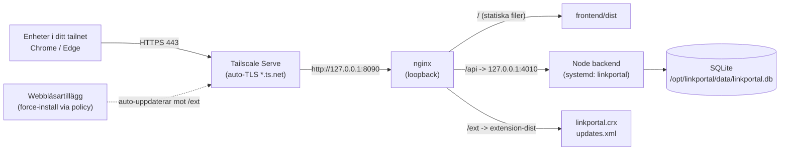

# LinkPortal på skzdev02 (Tailscale Serve)

Skräddarsydd driftsättning för **skzdev02** (Ubuntu) där HTTPS sköts av **Tailscale Serve**
i stället för nginx + eget certifikat. Servern kör redan en todo-app på
`https://skzdev02.tail898daf.ts.net:9121/` – den och `hermes` rörs **inte**; LinkPortal körs
parallellt på egna portar.

> Generisk Ubuntu-guide (nginx + eget cert) finns i [implementation.md](../../implementation.md).
> Det här dokumentet ersätter den för just skzdev02.

---

## 1. Arkitektur



**Varför den här formen?** Frontendens API-klient använder **relativ** bas-URL (`/api`) med
cookie, så webapp och API måste ligga på **samma origin**. Tailscale Serve ger en origin
(`https://skzdev02.tail898daf.ts.net/`), nginx delar upp den i statiska filer, `/api` och `/ext`.

### Portar (håller sig undan todo-appen på 9121)

| Vad | Adress | Exponerad? |
|-----|--------|-----------|
| Tailscale Serve (LinkPortal) | `:443` på `skzdev02.tail898daf.ts.net` | Ja, i tailnet |
| Todo-appen (befintlig) | `:9121` | Ja, i tailnet |
| nginx | `127.0.0.1:8090` | Nej (loopback) |
| Node backend | `127.0.0.1:4010` | Nej (loopback) |

---

## 2. Förutsättningar

- Sudo på skzdev02.
- Tailscale igång med **MagicDNS + HTTPS-certifikat** påslaget (redan sant – todo-appen kör HTTPS).
- Port **443** ledig i Tailscale Serve (`tailscale serve status` ska inte redan visa `:443`).
- Node LTS + nginx (installeras nedan om de saknas).

---

## 3. Kodfakta som styr deployen

| Fakta i koden | Konsekvens |
|---|---|
| Frontend `baseURL: '/api'` (relativ), `withCredentials` | Webapp + API **måste** vara samma origin → nginx framför båda. |
| Cookie `secure: isProd` i [auth.ts](../../backend/src/routes/auth.ts) | Kräver HTTPS. Tailscale Serve ger äkta HTTPS → fungerar. |
| `TRUST_PROXY` (nytt) i [config.ts](../../backend/src/config.ts) | **2 proxyhopp** här (Tailscale + nginx). Sätt `TRUST_PROXY=2`, annars ser login-rate-limit alla som `127.0.0.1` (en gemensam spärr för alla). |
| Prisma query-engine är plattformsspecifik | Kör `prisma generate` **på Ubuntu** – kopiera aldrig `node_modules` från Windows. |
| Backend serverar bara `/api/*` | Statiska filer + `/ext` serveras av nginx. |

---

## 4. Engångsuppsättning

### 4.1 Node LTS + nginx

```bash
curl -fsSL https://deb.nodesource.com/setup_22.x | sudo -E bash -
sudo apt-get install -y nodejs nginx
node -v        # v22.x
```

### 4.2 Tjänsteanvändare + kataloger

```bash
sudo useradd --system --no-create-home --shell /usr/sbin/nologin linkportal
sudo mkdir -p /opt/linkportal /opt/linkportal/data /opt/linkportal/extension-dist
```

### 4.3 Hämta koden

```bash
sudo git clone https://github.com/stkr01/linkportal.git /opt/linkportal
```

### 4.4 Backend: miljö, databas, bygg

```bash
cd /opt/linkportal/backend
npm ci

cp .env.production.example .env
openssl rand -hex 48        # kopiera värdet till JWT_SECRET nedan
nano .env
```

Sätt i `.env` (skzdev02-specifikt):

```ini
PORT=4010
NODE_ENV=production
HOST=127.0.0.1
TRUST_PROXY=2
JWT_SECRET=<klistra in openssl-värdet>
CORS_ORIGIN=https://skzdev02.tail898daf.ts.net
DATABASE_URL="file:/opt/linkportal/data/linkportal.db"
SEED_ADMIN_PASSWORD=<starkt engångslösenord>
```

```bash
npx prisma generate
npx prisma migrate deploy     # skapar/uppdaterar DB (INTE 'migrate dev')
npm run seed                  # bara första gången – skapar admin + exempeldata
npm run build                 # tsc -> dist/
```

### 4.5 Frontend: bygg statiska filer

```bash
cd /opt/linkportal/frontend
npm ci
npm run build                 # -> frontend/dist
```

### 4.6 Rättigheter

```bash
sudo chown -R linkportal:linkportal /opt/linkportal
```

### 4.7 systemd-tjänst

Återanvänder den härdade unit-filen (kör `node dist/server.js`, läser `.env` själv – porten
4010 kommer därifrån):

```bash
sudo cp /opt/linkportal/deploy/linkportal.service /etc/systemd/system/linkportal.service
sudo systemctl daemon-reload
sudo systemctl enable --now linkportal
journalctl -u linkportal -f   # ska visa "running on http://127.0.0.1:4010"
```

### 4.8 nginx (loopback)

```bash
sudo cp /opt/linkportal/deploy/skzdev02/nginx-linkportal.conf /etc/nginx/sites-available/linkportal
sudo ln -s /etc/nginx/sites-available/linkportal /etc/nginx/sites-enabled/
sudo nginx -t && sudo systemctl reload nginx
```

Filen [nginx-linkportal.conf](nginx-linkportal.conf) lyssnar på `127.0.0.1:8090`, serverar
`frontend/dist` på `/`, proxar `/api` → `127.0.0.1:4010`, serverar tillägget på `/ext` och har
SPA-fallback. **Ingen TLS här** – det sköter Tailscale.

### 4.9 Tailscale Serve (HTTPS på 443)

```bash
bash /opt/linkportal/deploy/skzdev02/tailscale-serve.sh
# motsvarar: sudo tailscale serve --bg --https=443 http://127.0.0.1:8090
```

> Skiljer sig syntaxen i din Tailscale-version? Kör `tailscale serve --help`. Todo-appen på
> 9121 påverkas inte – Serve hanterar varje port för sig.

### 4.10 Klart

Surfa till **`https://skzdev02.tail898daf.ts.net/`** och logga in som `admin` med lösenordet
du satte i `SEED_ADMIN_PASSWORD` (byt direkt). Ingen brandväggsöppning behövs – allt går via
Tailscale, och backend/nginx ligger på loopback.

---

## 5. Självhostat Chrome/Edge-tillägg (auto-uppdaterande CRX)

Chrome/Edge tillåter normalt bara installation från Web Store. För ett självhostat tillägg
**force-installerar** vi det via företagspolicy (`ExtensionInstallForcelist`) som pekar på en
**update-manifest** på servern. Då installeras och **auto-uppdateras** det utan användarklick.

### 5.1 Paketera (på servern, eller var som helst med Node)

```bash
cd /opt/linkportal/deploy/skzdev02/ext-packager
npm install
npm run build
```

[build.mjs](ext-packager/build.mjs) gör allt:

- Kopierar tilläggets filer till en ren `build/staging/` (utan `make-icons.js`).
- Injicerar prod-värden i kopiorna: `baseUrl` → `https://skzdev02.tail898daf.ts.net`,
  `host_permissions` → samma host, samt `update_url` → `/ext/updates.xml`.
- Signerar en **CRX3** med `extension-key.pem` (skapas första gången, **återanvänds** sedan så
  att tilläggets ID är stabilt).
- Skriver `build/updates.xml`, samt färdiga `build/policy-chrome.reg` och `build/policy-edge.reg`
  med rätt **extension-ID** ifyllt.

Skriptet skriver ut tilläggets **ID** och en färdig policy-sträng. Spara `extension-key.pem`
säkert – tappar du den ändras ID:t och redan installerade klienter slutar uppdatera.

> Vill du hellre låta varje port styras av en publik host i ett annat namn:
> `EXT_BASE_URL=https://… npm run build`.

### 5.2 Publicera på servern

```bash
sudo cp build/linkportal.crx build/updates.xml /opt/linkportal/extension-dist/
sudo chmod 755 /opt/linkportal/extension-dist && sudo chmod 644 /opt/linkportal/extension-dist/*
```

Verifiera att de nås (same-origin som webappen):

```bash
curl -fsS https://skzdev02.tail898daf.ts.net/ext/updates.xml
```

### 5.3 Rulla ut på klienterna (Win11, Chrome/Edge)

Kör motsvarande `build/policy-*.reg` (förhöjd behörighet), eller distribuera via GPO. Nycklarna
ligger under HKLM och gäller **även på fristående Win11** (ingen domän krävs):

```
HKLM\SOFTWARE\Policies\Google\Chrome\ExtensionInstallForcelist
  "1" = "<EXT_ID>;https://skzdev02.tail898daf.ts.net/ext/updates.xml"

HKLM\SOFTWARE\Policies\Microsoft\Edge\ExtensionInstallForcelist
  "1" = "<EXT_ID>;https://skzdev02.tail898daf.ts.net/ext/updates.xml"
```

Starta om webbläsaren → tillägget installeras tyst och låses (kan inte avinstalleras av
användaren). Klienten måste nå servern via Tailscale.

> **GPO-alternativ:** Importera ADMX-mallarna för Chrome/Edge och sätt *Configure the list of
> force-installed apps and extensions* till samma `ID;update_url`-sträng.

### 5.4 Släppa en ny version av tillägget

1. Höj `"version"` i [extension/manifest.json](../../extension/manifest.json) (t.ex. `1.0.0` → `1.0.1`).
2. `npm run build` igen (samma `extension-key.pem` → samma ID).
3. Kopiera nya `linkportal.crx` + `updates.xml` till `/opt/linkportal/extension-dist/`.
4. Klienterna upptäcker den nya versionen i `updates.xml` och uppdaterar automatiskt (inom några timmar, eller direkt via `chrome://extensions` → *Update*).

---

## 6. Uppdatera webappen senare

```bash
sudo -u linkportal APP_DIR=/opt/linkportal SERVICE=linkportal bash /opt/linkportal/deploy/deploy.sh
```

[deploy.sh](../deploy.sh) gör: `git pull` → `npm ci` → `prisma generate` → `npm run build` →
`prisma migrate deploy` → bygger frontend → `systemctl restart linkportal` → health-check.
Tailscale Serve och nginx ligger kvar orörda.

---

## 7. Felsökning

| Symptom | Trolig orsak / åtgärd |
|---------|-----------------------|
| `https://…ts.net/` ger 502 | nginx uppe men backend nere → `journalctl -u linkportal -e`. Lyssnar den på `127.0.0.1:4010`? Stämmer `PORT=4010`? |
| Sidan blank men `/api/health` svarar | Frontend ej byggd eller fel `root` i nginx, eller saknad SPA-fallback. |
| Inloggning loopar tillbaka | Inte HTTPS, eller `NODE_ENV` ≠ `production`. Secure-cookie kräver HTTPS (Tailscale ger det). |
| Alla låses ute efter någras felinloggningar | `TRUST_PROXY` ej satt till `2` → rate-limit ser alla som `127.0.0.1`. Sätt `TRUST_PROXY=2`, starta om tjänsten. |
| `tailscale serve status` visar inte `:443` | Kör om `tailscale-serve.sh`. Kolla att HTTPS-cert är påslaget för tailnet:et i admin-konsolen. |
| Tillägget installeras inte på klienten | Fel `EXT_ID` i policyn, klienten når inte servern via Tailscale, eller `/ext/updates.xml` är 404. Testa `curl` mot update-URL:en från klienten. |
| Prisma-fel om query engine | `node_modules` kopierades från Windows. Kör `npx prisma generate` på Ubuntu. |

Snabb hälsokoll:

```bash
curl -fsS http://127.0.0.1:4010/api/health           # backend direkt
curl -fsS https://skzdev02.tail898daf.ts.net/api/health   # via Tailscale+nginx
```

---

## 8. Filer i den här mappen

| Fil | Roll |
|-----|------|
| [CLAUDE_DEPLOY.md](CLAUDE_DEPLOY.md) | Uppdragsfil för Claude Code som kör lokalt på servern – idempotent steg-för-steg med skyddsregler. |
| [nginx-linkportal.conf](nginx-linkportal.conf) | nginx på `127.0.0.1:8090`: statisk frontend + `/api`-proxy + `/ext`-hosting + SPA-fallback. |
| [tailscale-serve.sh](tailscale-serve.sh) | Sätter upp Tailscale Serve `:443` → `127.0.0.1:8090`. |
| [ext-packager/build.mjs](ext-packager/build.mjs) | Bygger signerad CRX3 + `updates.xml` + policy-`.reg`-filer. |
| [ext-packager/package.json](ext-packager/package.json) | Beroende för paketeraren (`crx3`). |

Återanvänds från `deploy/`: [linkportal.service](../linkportal.service), [deploy.sh](../deploy.sh),
[backend/.env.production.example](../../backend/.env.production.example).
