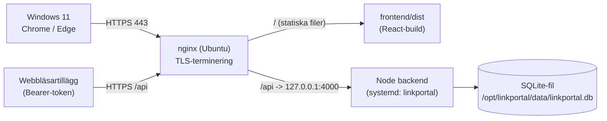

# LinkPortal – Implementation & Deploy (Ubuntu)

> Hur du publicerar **server­delarna** (backend-API + byggd frontend) på en Ubuntu-server.
> Klienterna är alltid **Chrome eller Edge på Windows 11**. Tillägget (`extension/`) installeras
> separat i webbläsaren och pratar med samma server.

Se [README.md](./README.md) för utvecklings­start och [BLUEPRINT.md](./BLUEPRINT.md) för vision/datamodell.
Färdiga filer för det här finns i mappen [`deploy/`](./deploy).

---

## 1. Arkitektur

Frontendens API-klient använder **relativ** bas-URL (`/api`) med cookies. Därför körs allt
bakom **en** webbserver (nginx) på **samma origin** – då slipper du CORS-strul för webappen
och inloggnings­cookien fungerar direkt.



| Komponent | Körning på servern |
|-----------|--------------------|
| **nginx** | TLS, serverar statisk frontend på `/`, proxar `/api` → Node |
| **Node backend** | systemd-tjänst, lyssnar på `127.0.0.1:4000` (bara nginx når den) |
| **SQLite** | en fil i `/opt/linkportal/data/` (utanför git-trädet) |
| **Tillägget** | installeras i klientens webbläsare, använder Bearer-token mot `/api` |

---

## 2. Förutsättningar

- Ubuntu-server (22.04/24.04 LTS) med sudo.
- Ett DNS-namn till servern, t.ex. `linkportal.foretag.local` (krävs för certifikat & cookie).
- Ett TLS-certifikat (se [avsnitt 7](#7-https-alternativ)). **HTTPS är obligatoriskt** – se nedan.

---

## 3. Kodfakta som styr deployen

Det här är hämtat direkt ur koden och avgör hur servern måste sättas upp:

| Fakta i koden | Konsekvens på servern |
|---|---|
| Frontend: `baseURL: '/api'` (relativ) i [frontend/src/api/client.ts](frontend/src/api/client.ts) | Webappen **måste** serveras från samma origin som API:t → nginx framför både statiska filer och `/api`. |
| Cookie: `secure: isProd` i [backend/src/routes/auth.ts](backend/src/routes/auth.ts) | Med `NODE_ENV=production` sätts **Secure**-flaggan → inloggningen fungerar **bara över HTTPS**. Ren HTTP = cookien fastnar aldrig. |
| `bcryptjs` (ren JS, inte native `bcrypt`) | ✅ Inget kompilerings­strul på Linux. |
| Prisma query-engine är plattforms­specifik | Kör `npx prisma generate` **på Ubuntu** – kopiera aldrig `node_modules` från Windows. |
| `express-rate-limit` bakom proxy | `app.set('trust proxy', 1)` är satt i [backend/src/server.ts](backend/src/server.ts) (aktivt i prod). |
| Backend serverar **bara** `/api/*` | Frontendens statiska filer serveras av nginx, inte av Node. |
| Tillägget: Bearer-token + konfigurerbar `baseUrl` i [extension/api.js](extension/api.js) | Funkar cross-origin via `host_permissions`; sätt prod-URL innan utrullning. |
| Backend binder `127.0.0.1` i prod (`config.host`) | API:t exponeras aldrig direkt – endast via nginx. |

> De två sista raderna är kod som lades till specifikt för den här deployen
> (`trust proxy` + loopback-bindning), styrt av `NODE_ENV=production`.

---

## 4. Engångsuppsättning på Ubuntu

### 4.1 Installera Node LTS + nginx

```bash
curl -fsSL https://deb.nodesource.com/setup_22.x | sudo -E bash -
sudo apt-get install -y nodejs nginx
node -v        # bör visa v22.x
```

### 4.2 Skapa tjänsteanvändare och kataloger

```bash
sudo useradd --system --no-create-home --shell /usr/sbin/nologin linkportal
sudo mkdir -p /opt/linkportal /opt/linkportal/data
```

### 4.3 Hämta koden

```bash
sudo git clone https://github.com/stkr01/linkportal.git /opt/linkportal
```

### 4.4 Backend: miljö, databas, bygg

```bash
cd /opt/linkportal/backend
npm ci

# Skapa prod-.env från mallen och fyll i riktiga värden
cp .env.production.example .env
# Generera en stark hemlighet och klistra in i .env (JWT_SECRET):
openssl rand -hex 48
# Redigera .env: JWT_SECRET, CORS_ORIGIN=https://<ditt-dns>, DATABASE_URL=file:/opt/linkportal/data/linkportal.db
nano .env

npx prisma generate
npx prisma migrate deploy     # skapar/uppdaterar databasen (INTE 'migrate dev')
npm run seed                  # bara första gången – skapar admin + exempeldata
npm run build                 # tsc -> dist/
```

### 4.5 Frontend: bygg statiska filer

```bash
cd /opt/linkportal/frontend
npm ci
npm run build                 # -> frontend/dist (serveras av nginx)
```

### 4.6 Rättigheter

```bash
sudo chown -R linkportal:linkportal /opt/linkportal
```

### 4.7 systemd-tjänst

```bash
sudo cp /opt/linkportal/deploy/linkportal.service /etc/systemd/system/linkportal.service
sudo systemctl daemon-reload
sudo systemctl enable --now linkportal
journalctl -u linkportal -f   # följ loggen, bör visa "running on http://127.0.0.1:4000"
```

Tjänstefilen: [deploy/linkportal.service](deploy/linkportal.service). Den laddar `.env` via appens
egen dotenv (ingen `EnvironmentFile` behövs) och är härdad (`ProtectSystem=strict`, skriv­bart
bara i `/opt/linkportal/data`).

### 4.8 nginx

```bash
sudo cp /opt/linkportal/deploy/nginx-linkportal.conf /etc/nginx/sites-available/linkportal
sudo ln -s /etc/nginx/sites-available/linkportal /etc/nginx/sites-enabled/
# Redigera server_name + ssl_certificate-sökvägar i filen:
sudo nano /etc/nginx/sites-available/linkportal
sudo nginx -t && sudo systemctl reload nginx
```

Config: [deploy/nginx-linkportal.conf](deploy/nginx-linkportal.conf) – serverar `frontend/dist` på `/`,
proxar `/api` → `127.0.0.1:4000`, och har SPA-fallback (`try_files … /index.html`) för React Router.

### 4.9 Brandvägg

```bash
sudo ufw allow 'Nginx Full'   # 80 + 443
sudo ufw enable
# Öppna INTE 4000 utåt – backend nås bara internt via nginx.
```

Klart – surfa till `https://<ditt-dns>` och logga in som `admin / ChangeMe123!` (byt direkt).

---

## 5. Miljövariabler (prod)

Mall: [backend/.env.production.example](backend/.env.production.example). Viktigast:

| Variabel | Värde i prod | Varför |
|----------|--------------|--------|
| `NODE_ENV` | `production` | Slår på Secure-cookie + `trust proxy` + loopback-bindning. |
| `HOST` | `127.0.0.1` | API:t nås bara via nginx. |
| `JWT_SECRET` | lång slump (`openssl rand -hex 48`) | Signerar inloggnings-token. **Byt!** |
| `CORS_ORIGIN` | `https://<ditt-dns>` | Härdning (webappen är same-origin och behöver den inte, men håll den rätt). |
| `DATABASE_URL` | `file:/opt/linkportal/data/linkportal.db` | DB utanför git-trädet, överlever `git pull`. |

> `.env` ligger **inte** i git. Skapa den på servern.

---

## 6. Uppdatera till ny version

När en ny version finns på GitHub:

```bash
sudo -u linkportal APP_DIR=/opt/linkportal bash /opt/linkportal/deploy/deploy.sh
```

Skriptet [deploy/deploy.sh](deploy/deploy.sh) gör: `git pull` → `npm ci` → `prisma generate`
→ `npm run build` → `prisma migrate deploy` (backend) → `npm ci` + `npm run build` (frontend)
→ `systemctl restart linkportal` → health-check mot `/api/health`.

---

## 7. HTTPS-alternativ

Klienterna är domän-Windows 11, så välj det som passar miljön:

- **Internt AD-certifikat (AD CS)** – *rekommenderas i företagsnät.* Certet litas på
  automatiskt via GPO på domän­anslutna Win11 → inga varningar, Secure-cookien funkar.
- **Let's Encrypt** (`sudo apt install certbot python3-certbot-nginx; sudo certbot --nginx`)
  – om servern har ett publikt DNS-namn.
- **Caddy istället för nginx** – sköter HTTPS automatiskt och har enklare config. Bra om du
  vill slippa certifikat­handpåläggning (kräver dock en CA Caddy kan validera mot).

Oavsett val: peka `ssl_certificate` / `ssl_certificate_key` i nginx-configen mot rätt filer.

---

## 8. Webbläsartillägget i produktion

Tillägget pratar med samma server via Bearer-token. Inför utrullning:

1. **Peka mot prod-URL.** Antingen låter du varje användare ange `https://<ditt-dns>` under
   ⚙️ i tillägget (och godkänna host-behörighet), **eller** baka in det:
   - ändra `DEFAULTS.baseUrl` i [extension/api.js](extension/api.js)
   - lägg till hosten i `host_permissions` i [extension/manifest.json](extension/manifest.json)
2. **Tyst utrullning i org:** publicera tillägget och använd Edge/Chrome-policyn
   `ExtensionInstallForcelist`.
3. **`rdp://` / `ssh://`-länkar:** registrera protokoll­hanterarna på klienterna (se README)
   och slipp klick-prompten med policyn `AutoLaunchProtocolsFromOrigins` för portalens origin.

---

## 9. Databas & backup

- **Ny server:** `prisma migrate deploy` + `npm run seed` → logga in och byt admin-lösenord.
- **Ta med befintlig data:** stoppa tjänsten, kopiera `linkportal.db` till
  `/opt/linkportal/data/`, starta igen:
  ```bash
  sudo systemctl stop linkportal
  sudo cp /sökväg/linkportal.db /opt/linkportal/data/linkportal.db
  sudo chown linkportal:linkportal /opt/linkportal/data/linkportal.db
  sudo systemctl start linkportal
  ```
- **Backup (cron, daglig):**
  ```bash
  sudo apt-get install -y sqlite3
  # /etc/cron.daily/linkportal-backup  (chmod +x)
  sqlite3 /opt/linkportal/data/linkportal.db ".backup '/var/backups/linkportal-$(date +\%F).db'"
  ```
  `.backup` är säkert även medan tjänsten kör (till skillnad från att bara kopiera filen).

---

## 10. Felsökning

| Symptom | Trolig orsak / åtgärd |
|---------|-----------------------|
| Inloggning "fastnar inte", loopar tillbaka till login | Kör inte över HTTPS, eller `NODE_ENV` ≠ `production` med fel cookie-läge. Secure-cookie kräver HTTPS. |
| 502 Bad Gateway i nginx | Backend-tjänsten nere → `journalctl -u linkportal -e`. Kontrollera att den lyssnar på `127.0.0.1:4000`. |
| API svarar men webappen är blank | Frontend inte byggd / fel `root` i nginx, eller saknad SPA-fallback (`try_files … /index.html`). |
| Prisma-fel om query engine | `npx prisma generate` kördes inte på Linux (kopierade `node_modules` från Windows). Kör om. |
| Rate-limit slår fel / varning om `X-Forwarded-For` | `trust proxy` – redan satt i prod; säkerställ att `NODE_ENV=production`. |
| 413 vid spara länk med stor bild | Höj `client_max_body_size` i nginx (satt till 5m) – och ev. body-limit i Express. |

Snabb hälsokoll på servern:
```bash
curl -fsS http://127.0.0.1:4000/api/health   # {"status":"ok",...}
```

---

## 11. Filer för deployen

| Fil | Roll |
|-----|------|
| [deploy/linkportal.service](deploy/linkportal.service) | systemd-tjänst för backend (härdad, auto-restart). |
| [deploy/nginx-linkportal.conf](deploy/nginx-linkportal.conf) | nginx: TLS + statisk frontend + `/api`-proxy + SPA-fallback. |
| [deploy/deploy.sh](deploy/deploy.sh) | Bygg/uppdaterings­skript (pull → build → migrate → restart). |
| [backend/.env.production.example](backend/.env.production.example) | Mall för prod-`.env` (kopieras till `.env` på servern). |

**Kodjusteringar gjorda för prod** (aktiva endast när `NODE_ENV=production`):
[backend/src/server.ts](backend/src/server.ts) – `trust proxy` + bindning till `127.0.0.1`;
[backend/src/config.ts](backend/src/config.ts) – ny `host`-inställning (env `HOST`).
